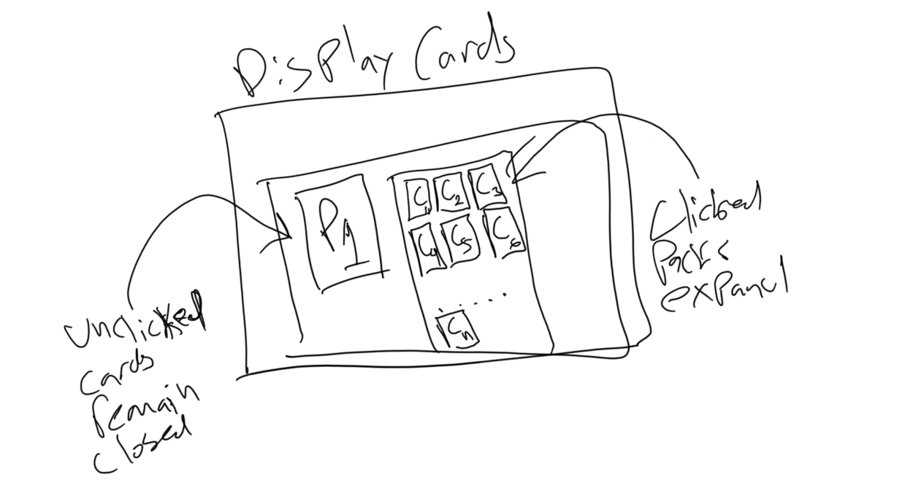

# Initial Drafting Flow
This flow is to allow any user to be able to use our application to select different sets of yugioh to be able to use in a draft format to compete against other players either physically or digitally. We want to be able to make it fun and easy to use.

From a high level we want users to be prompted to select the packs they will be drafting with and how much they want to draft of those specific cards. After they have confirmed their selection we transition to a screen where they can either open their packs one at a time or all at once i.e. skipping the tedious pack opening phase. Regardless the UI should still showcase what cards belonged to what exact packs. This is it and for now is the main flow we will be focusing on.

Initially we want to render a screen like this where we display each set as it own card that can be interacted with i.e. clicked on to select that one for drafting.

After a set has been picked the UI should show with some kind of indicator the amount of times the set has been selected and allow a way to remove one fromo the total. Optionally we should consider a button to be able to deselect a set entirely irregardless of how many in that set were previously selected.

The screen then renders a button to confirm your selection after a single set has been selected to draft from even if we only want a single pack form that set. This button as both a way to transition to the screen to display packs returned by the api but to alos generate card packs that will then be on the screen. 

On this screen we aggregate the packs in each set and display each set of packs individually waiting for them to be opened.

We will need to render a skip button to allow users to be able to skip ahead and open all the packs that are displayed and also allow them to click on a specific pack in a set to then expand the cards within it.

When expanding the display we render small images for the cards and still keep the high level component in the list for the set they are in. If skip was selected we still render cards this way just without having any in the pre-open state.

All of this is the minimum required for using this app as a drafting tool. 
